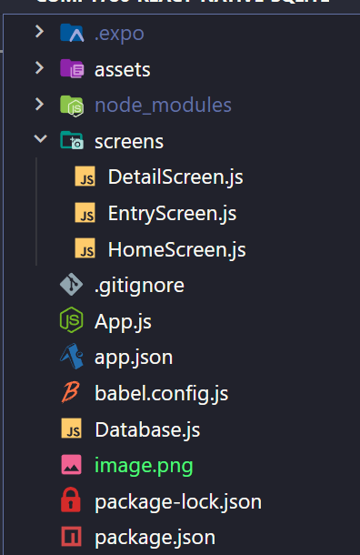
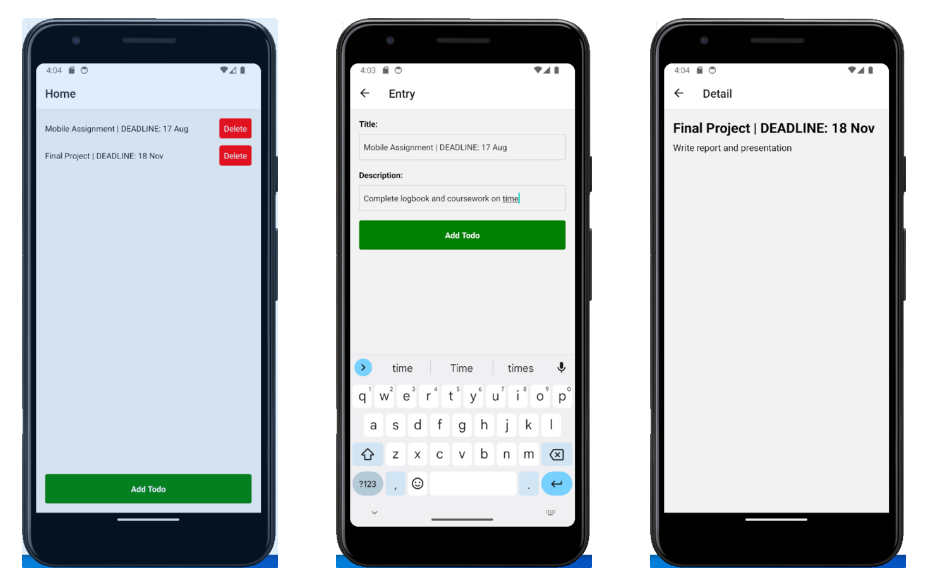
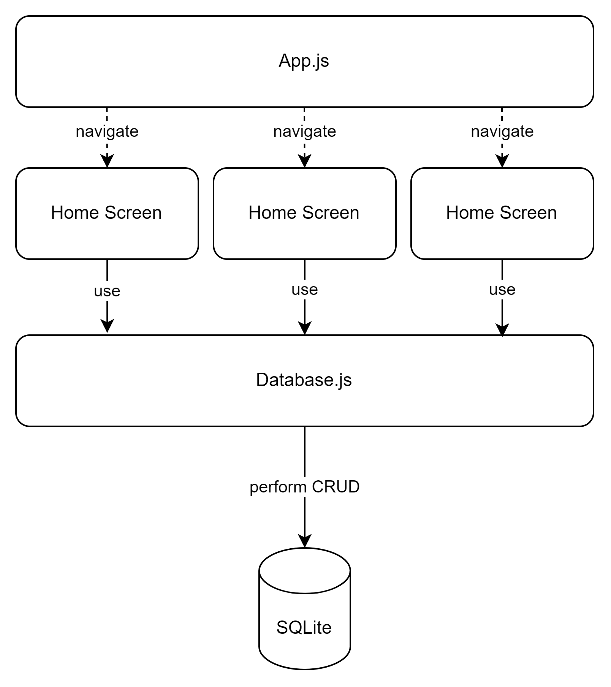
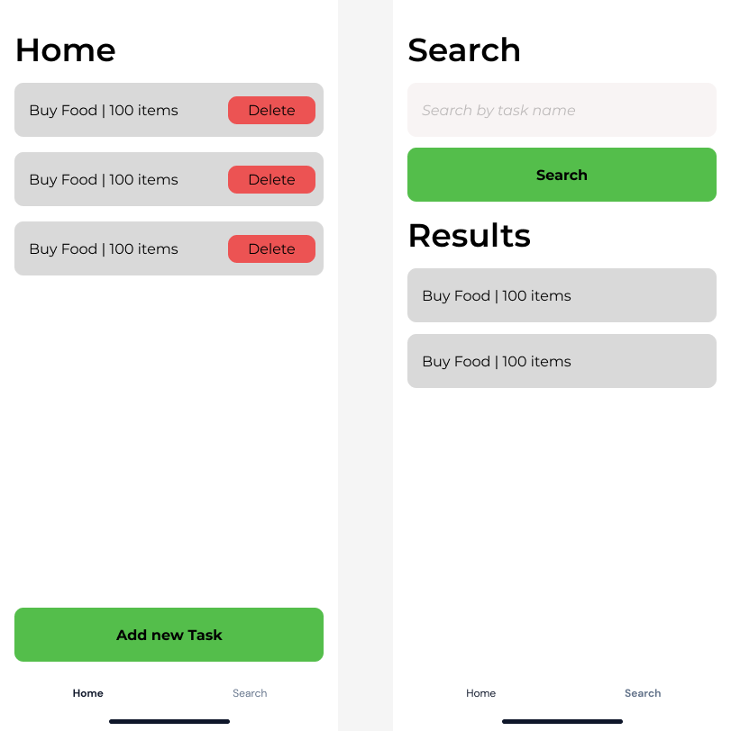

## Step 1: Set up the project

First, create a new React Native project using the React Native CLI:

```
npx create-expo-app TodoApp --template blank
cd TodoApp
```

The final folder structure will be like this:



The final Images of the application



The following diagram shows how the application structure works with SQLite database and the responsibility of each file



## Step 2: Install dependencies

Install the required dependencies for SQLite and navigation:

```
npm install expo-sqlite @react-navigation/native @react-navigation/stack
```

## Step 3: Set up App.js, Navigation and create the Database

Create a new file named **`App.js`** in the root of your project and replace the default code with the following:

```jsx
import { NavigationContainer } from "@react-navigation/native";
import { createStackNavigator } from "@react-navigation/stack";
import { SQLiteProvider } from "expo-sqlite";
import React from "react";
import DetailScreen from "./screens/DetailScreen";
import EntryScreen from "./screens/EntryScreen";
import HomeScreen from "./screens/HomeScreen";
import SearchScreen from "./screens/SearchScreen";
const Stack = createStackNavigator();

async function initializeDatabase(db) {
  try {
    await db.execAsync(`
            PRAGMA journal_mode = WAL;
            CREATE TABLE IF NOT EXISTS todos (
            id INTEGER PRIMARY KEY AUTOINCREMENT,
            title TEXT,
            description TEXT
            );
        `);
    console.log("Database initialised");
  } catch (error) {
    console.log("Error while initializing database : ", error);
  }
}

const App = () => {
  return (
    <SQLiteProvider databaseName="todos.db" onInit={initializeDatabase}>
      <NavigationContainer>
        <Stack.Navigator initialRouteName="Home">
          <Stack.Screen name="Home" component={HomeScreen} />
          <Stack.Screen name="Entry" component={EntryScreen} />
          <Stack.Screen name="Detail" component={DetailScreen} />
          <Stack.Screen name="Search" component={SearchScreen} />
        </Stack.Navigator>
      </NavigationContainer>
    </SQLiteProvider>
  );
};

export default App;
```

## Step 5: Create screens

Create three new files inside the **`screens`** directory: **`HomeScreen.js`**, **`EntryScreen.js`**, and **`DetailScreen.js`**.

### HomeScreen.js

In **`HomeScreen.js`**, add the following code:

```jsx
import { useIsFocused } from "@react-navigation/native";
import { useSQLiteContext } from "expo-sqlite";
import React, { useEffect, useState } from "react";
import {
  FlatList,
  StyleSheet,
  Text,
  TouchableOpacity,
  View,
} from "react-native";

const HomeScreen = ({ navigation }) => {
  const [todos, setTodos] = useState([]);
  const isFocused = useIsFocused();
  const db = useSQLiteContext();

  const getTodos = async () => {
    try {
      const allTodos = await db.getAllAsync("SELECT * FROM todos");
      setTodos(allTodos);
    } catch (error) {
      console.log("Error fetching todos", error);
    }
  };

  const deleteTodo = async (id) => {
    try {
      const statement = await db.prepareAsync(`DELETE FROM todos WHERE id = ?`);
      await statement.executeAsync([id]);
      console.log("Todo deleted successfully");
    } catch (error) {
      console.log("Error deleting todo", error);
    }
  };

  useEffect(() => {
    getTodos();
  }, [isFocused]);

  const handleDeleteTodo = async (id) => {
    await deleteTodo(id);
    await getTodos();
  };

  const renderTodoItem = ({ item }) => (
    <TouchableOpacity
      style={styles.todoItem}
      onPress={() => navigation.navigate("Detail", { todo: item })}
    >
      <Text>{item.title}</Text>
      <TouchableOpacity
        style={styles.deleteButton}
        onPress={() => handleDeleteTodo(item.id)}
      >
        <Text style={styles.deleteButtonText}>Delete</Text>
      </TouchableOpacity>
    </TouchableOpacity>
  );

  return (
    <View style={styles.container}>
      <FlatList
        data={todos}
        renderItem={renderTodoItem}
        keyExtractor={(item) => item.id.toString()}
      />
      <TouchableOpacity
        style={styles.addButton}
        onPress={() => navigation.navigate("Entry")}
      >
        <Text style={styles.addButtonText}>Add Todo</Text>
      </TouchableOpacity>
    </View>
  );
};

const styles = StyleSheet.create({
  container: {
    flex: 1,
    padding: 16,
  },
  todoItem: {
    flexDirection: "row",
    justifyContent: "space-between",
    alignItems: "center",
    marginBottom: 12,
  },
  deleteButton: {
    backgroundColor: "red",
    padding: 8,
    borderRadius: 4,
  },
  deleteButtonText: {
    color: "white",
  },
  addButton: {
    backgroundColor: "green",
    padding: 16,
    borderRadius: 4,
    alignItems: "center",
  },
  addButtonText: {
    color: "white",
    fontWeight: "bold",
  },
});

export default HomeScreen;
```

### EntryScreen.js

In **`EntryScreen.js`**, add the following code:

```jsx
import { useSQLiteContext } from "expo-sqlite";
import React, { useState } from "react";
import {
  Alert,
  StyleSheet,
  Text,
  TextInput,
  TouchableOpacity,
  View,
} from "react-native";

const EntryScreen = ({ navigation }) => {
  const db = useSQLiteContext();
  const [title, setTitle] = useState("");
  const [description, setDescription] = useState("");

  const handleAddTodo = async () => {
    if (!title || !description) {
      Alert.alert("Error", "Please enter title and description");
      return;
    }
    await addTodo(title, description);
    navigation.goBack();
  };

  const addTodo = async (title, description) => {
    try {
      const statement = await db.prepareAsync(
        `INSERT INTO todos (title, description) VALUES (?, ?)`
      );
      await statement.executeAsync([title, description]);
      console.log("Todo added successfully");
    } catch (error) {
      console.log("Error adding todo", error);
    }
  };

  return (
    <View style={styles.container}>
      <Text style={styles.label}>Title:</Text>
      <TextInput
        style={styles.input}
        value={title}
        onChangeText={setTitle}
        placeholder="Enter title"
      />
      <Text style={styles.label}>Description:</Text>
      <TextInput
        style={styles.input}
        value={description}
        onChangeText={setDescription}
        placeholder="Enter description"
        multiline
      />
      <TouchableOpacity style={styles.addButton} onPress={handleAddTodo}>
        <Text style={styles.addButtonText}>Add Todo</Text>
      </TouchableOpacity>
    </View>
  );
};

const styles = StyleSheet.create({
  container: {
    flex: 1,
    padding: 16,
  },
  label: {
    fontWeight: "bold",
    marginBottom: 8,
  },
  input: {
    borderWidth: 1,
    borderColor: "#ccc",
    borderRadius: 4,
    marginBottom: 16,
    padding: 8,
  },
  addButton: {
    backgroundColor: "green",
    padding: 16,
    borderRadius: 4,
    alignItems: "center",
  },
  addButtonText: {
    color: "white",
    fontWeight: "bold",
  },
});

export default EntryScreen;
```

### DetailScreen.js

In **`DetailScreen.js`**, add the following code:

```jsx
import React from "react";
import { StyleSheet, Text, View } from "react-native";

const DetailScreen = ({ route }) => {
  const { todo } = route.params;

  return (
    <View style={styles.container}>
      <Text style={styles.title}>{todo.title}</Text>
      <Text style={styles.description}>{todo.description}</Text>
    </View>
  );
};

const styles = StyleSheet.create({
  container: {
    flex: 1,
    padding: 16,
  },
  title: {
    fontWeight: "bold",
    fontSize: 24,
    marginBottom: 8,
  },
  description: {
    fontSize: 16,
  },
});

export default DetailScreen;
```

## Exercise



### Hint

Study the documentation of React Bottom Tab

https://reactnavigation.org/docs/bottom-tab-navigator

https://reactnavigation.org/docs/nesting-navigators/
